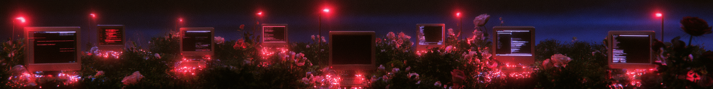
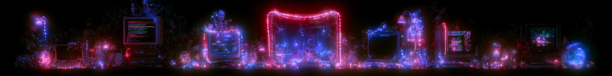
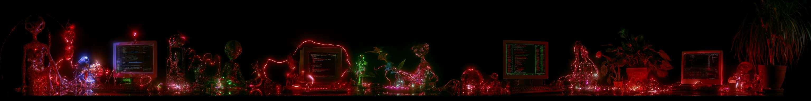

  

# aliens built my website

**Superstar** — a Claude skill that builds and audits websites against one bar:
does it have a real reason to exist, does it solve something, is it beautiful,
usable, secure, and GDPR-compliant. No exceptions on the last part.

---

## Who I am

I'm Sinaida Krivchenko — a new media artist working in TouchDesigner, generative
AI, and code, based in Prague. Before this I spent a decade as a creative
director in the cultural sector (Diamond Museum Amsterdam, a Dutch ballet
foundation), and before that, in biomedical engineering and IT project
management at GE. I design visual worlds meant to be experienced in physical
spaces, and I build the systems that hold them up.

**[sinaida.eu](https://sinaida.eu/)** · **[@sin.ai.da](https://www.instagram.com/sin.ai.da/)**

---

## Why I built this

I wanted a website. What I actually wanted was a *system* — something that would
ask the right questions before writing a single line of code, hold the line on
the boring-but-essential parts (a privacy policy that isn't a placeholder, a
cookie banner that isn't a dark pattern, a 404 page that doesn't break the
illusion), and still leave room for something that looks like it belongs in a
gallery, not a template marketplace.

I love that a website can be both: an engineering problem with real constraints
— load time, accessibility, GDPR, security headers — and a beautiful object.
Biomedical engineering taught me that a system's elegance shows up in how it
handles its edge cases, not just its happy path. This skill is that instinct
applied to web design: interview first, approve content before building, then
build something that's fast on a bad connection and gorgeous on a good one.

It also audits. Half the web is existing sites nobody's checked against a real
standard since launch. This does that too, against the exact same checklist it
builds against — Nielsen Norman Group's usability heuristics, GDPR compliance,
technical SEO, adaptive performance for slow networks and weak GPUs, and fonts
that are actually free to use commercially and actually readable.

---

## What's in here

- **`superstar-skill/`** — the full Claude skill: build-mode interview, content
  approval gate, implementation checklist, audit-mode report format, and every
  reference doc (UX heuristics, security, GDPR/cookie/privacy templates, SEO,
  fonts, adaptive performance, GitHub hygiene, and an opt-in HDR glow-logo
  technique).
- **`perplexity_guide.pdf`** — the research brief this skill's UX/performance/
  security baseline was distilled from.
- **`*.png`** — mood boards. Aliens, CRT terminals, roses, neon. The aesthetic
  this project keeps in mind even when the deliverable is a privacy policy.

## How it works

**Build mode**: ask why the site needs to exist at all, what business outcome
it serves, who's visiting and what they should do — before drafting content,
and before drafting content before touching implementation. Every build ships
with a real privacy policy, a consent-respecting cookie banner, a site-styled
404, adaptive/light-mode performance, and a font stack that's actually licensed
for commercial use.

**Audit mode**: the same checklist, run against a site that already exists.
Reports gaps by severity — a missing privacy policy outranks a suboptimal font.

  

---

**[sinaida.eu](https://sinaida.eu/)** · **[@sin.ai.da](https://www.instagram.com/sin.ai.da/)**

  

